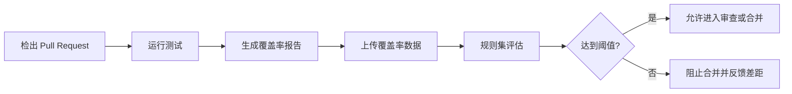

9 月 18 日，GitHub 宣布可以通过正式可用的 REST API 管理代码覆盖率规则集条件。维护者现在不必逐个打开仓库设置页面，就能为 Pull Request 配置最低行覆盖率，或限制相对于默认分支允许下降的覆盖率百分点。

这项更新的重点不是“把覆盖率数字搬到了 API”，而是让质量门禁开始具备策略即代码的形态：规则可以和仓库清单、基础配置、审查流程一起版本化，也可以由平台团队批量同步到多个仓库。不过，覆盖率规则仍然需要 GitHub Code Quality 和覆盖率上传链路提供数据；规则的意义也不是把所有项目强行锁在同一个百分比上。门禁能否真正改善质量，取决于阈值是否建立在可信基线和可解释的工程约束之上。

<!-- more -->

## 这次 API 更新了什么

GitHub 的更新针对的是规则集中的 `Restrict code coverage` 条件。它可以用两种方式阻止 Pull Request 合并：

| 条件 | 判断方式 | 适合解决的问题 |
| --- | --- | --- |
| 最低行覆盖率 | PR 分支的聚合行覆盖率低于设定百分比时阻止合并 | 防止新代码让整体基线跌破底线 |
| 最大覆盖率下降 | 相对默认分支下降超过设定百分点时阻止合并 | 允许不同仓库有不同基线，限制回归幅度 |

REST API 的规则片段可以表达为：

```json
{
  "type": "code_coverage",
  "parameters": {
    "minimum_coverage": 80,
    "max_coverage_drop": 3
  }
}
```

这只是规则集中的 `rules` 片段。完整的规则集还需要指定目标类型、匹配的分支或标签以及 `active`、`evaluate` 等执行状态，实际字段应以当前 API 文档为准。两个阈值表达的是不同策略：`80` 是绝对底线，`3` 是相对于默认分支允许下降的百分点，不能把“覆盖率下降 3%”简单理解成“下降 3 个百分点”。

过去，这项规则主要通过网页界面配置。现在，平台团队可以用 API 创建、读取和更新规则，把“哪些仓库需要什么门槛”放在配置文件或内部治理系统里，再由自动化程序调用仓库规则集接口完成同步。

## 先把前置条件分清楚

覆盖率规则不会凭空产生数据。GitHub 的公告和文档列出了两个关键前提：

1. 仓库已经启用 GitHub Code Quality；
2. CI 已经上传了代码覆盖率数据。

因此，接入顺序应该是“先让数据稳定，再让规则阻断”。如果测试没有生成报告、报告格式不被识别、上传发生在规则评估之后，规则就很难提供可靠的合并判断。API 请求成功也不代表覆盖率门禁已经生效，仍要在真实 Pull Request 上验证从测试到上传、从上传到规则评估的完整链路。

这项能力目前可用于 GitHub Enterprise Cloud、包含 Data Residency 的 GitHub Enterprise Cloud，以及 GitHub Team；GitHub Enterprise Server 不在公告列出的支持范围内。混用 GitHub.com 与 GHES 的团队不能只复制同一份规则配置，还要在发布平台前先检查产品能力和 API 支持情况。

## 两种阈值应该怎样选择

### 绝对最低覆盖率：适合定义底线

`minimum_coverage` 适合用在有较稳定测试体系的服务或库中。例如，一个已有 85% 行覆盖率的核心模块，可以设定 80% 的最低值，避免后续合并把整个基线拖到一个明显更差的水平。

但新仓库不应一开始就随意设定一个漂亮的百分比。测试还不完整时，绝对门槛可能导致团队先补大量低价值测试，只为让数字达标。更稳妥的做法是先观察一段时间的覆盖率分布，确认测试报告稳定，再把当前可持续的水平转成门禁。

### 最大下降幅度：适合控制回归

`max_coverage_drop` 更适合覆盖率已经存在差异的多仓库组织。它不要求所有仓库都达到同一个绝对值，而是约束每个 Pull Request 相对于自己默认分支的回退。

例如，A 仓库长期在 92%，B 仓库长期在 64%。如果统一设置 80%，B 仓库会立刻被大量历史问题卡住；如果只允许下降 2 个百分点，两个仓库都能先防止新的回归。这个策略不能自动消除 B 仓库的技术债，但不会把“改善历史基线”和“防止新问题”混成一次大迁移。

### 两个条件可以组合，但不要掩盖数据含义

绝对底线和相对下降可以同时使用：一个防止长期低于最低标准，一个防止单次变更造成明显回退。组合前要先确认团队理解的是“行覆盖率”还是分支、函数、条件覆盖率等其他指标。当前这条规则针对的是行覆盖率，不能把它当成完整的测试充分性证明。

## API 化之后，治理方式会发生什么变化

### 1. 规则可以进入基础设施代码

平台仓库可以维护一份规则声明，记录每个仓库对应的目标范围、执行状态、最低覆盖率和允许下降幅度。变更经过 Pull Request 审查后，再由具有最小权限的 GitHub App 或自动化服务调用 API 同步。

这种方式比人工点击更容易复盘：团队可以回答“谁在什么时候把某个仓库的覆盖率门槛从 80 调成 75”，也可以把规则配置和应用迁移、测试框架升级放在同一个变更上下文中。

### 2. 规则漂移可以被发现

批量管理的难点不是第一次写入，而是以后有人通过网页修改了单个仓库。同步程序可以定期读取仓库规则集，与期望配置做差异比较，并把漂移报告给平台团队。自动修复之前，应先区分有意的例外、临时迁移和未授权修改，避免一个全局同步任务覆盖正在进行的仓库升级。

### 3. 例外需要被显式管理

不同仓库的测试成本、代码类型和发布风险不同。例外并不一定是不合规，但它应该有负责人、原因、有效期和复查时间。把“这个仓库暂时不设置规则”留在人工记忆里，会比规则本身更难审计。

建议把这些信息放在配置层：

```yaml
repositories:
  - name: payment-service
    coverage:
      minimum: 80
      max_drop: 2
  - name: legacy-adapter
    coverage:
      max_drop: 1
      exception:
        reason: "正在迁移覆盖率上传工具"
        expires: "2026-10-15"
```

这里的 YAML 只是治理系统的示意格式，不是 GitHub REST API 的直接请求体。真正调用 API 时，仍应将它转换成仓库规则集接口需要的 JSON，并校验仓库、组织和产品计划是否支持该规则。

## 把覆盖率门禁接进 CI 的正确顺序

一个可观察的流水线应该把覆盖率产生和规则评估明确分开：



落地时要重点检查几个失败场景：

- 测试失败时是否仍会错误地上传一份旧报告；
- 覆盖率上传失败时，规则是阻止合并还是只产生告警；
- Pull Request 的基准分支是否发生变化，导致比较基线改变；
- 合并队列或重跑工作流时，覆盖率数据是否与当前提交对应；
- monorepo 中只改一个子目录时，全仓库行覆盖率是否仍然是团队想要的指标。

尤其要避免“为了过门禁而降低测试范围”这种反向激励。代码覆盖率应与测试失败、静态检查、代码审查和生产缺陷等信号一起观察；它能告诉团队哪些行没有被执行，却不能告诉团队测试断言是否有意义。

## 建议用观察期完成迁移

如果组织准备为多个仓库统一配置规则，可以采用四个阶段：

1. **盘点阶段**：确认 Code Quality、覆盖率上传和默认分支状态，收集每个仓库最近一段时间的覆盖率基线。
2. **影子阶段**：先用规则集的非阻断状态观察会被拦截的 Pull Request，统计缺失报告、历史低基线和真实回归分别占多少。
3. **分组启用**：先选择测试稳定、发布风险高的服务启用阻断，再逐步扩展到普通仓库。
4. **持续复查**：规则配置由 API 定期读取，报告漂移、例外到期和覆盖率数据中断，不要只在规则首次创建时验证一次。

如果规则的执行状态和“影子阶段”能力要依赖具体产品配置，应以 GitHub 当前文档为准；不要在没有验证的情况下把 `evaluate` 当成所有仓库都拥有的完整模拟环境。

## 结语

GitHub 将代码覆盖率规则带进 REST API，真正改变的是质量门禁的管理方式：它可以从一个需要手工点击的仓库设置，变成一条可审查、可批量同步、可检测漂移的工程策略。

但 API 不会替团队决定合理的质量标准。先稳定覆盖率数据，再区分绝对底线和相对回退；先观察实际误报，再逐步阻断；给每个例外记录原因和期限。这样，覆盖率数字才会成为帮助团队发现回归的信号，而不是又一个需要想办法绕过的 CI 红灯。

## 参考来源

- [GitHub Changelog：Manage the code coverage ruleset condition with the REST API](https://github.blog/changelog/2026-09-18-manage-the-code-coverage-ruleset-condition-with-the-rest-api)
- [GitHub Docs：Available rules for rulesets—Restrict code coverage](https://docs.github.com/en/repositories/configuring-branches-and-merges-in-your-repository/managing-rulesets/available-rules-for-rulesets#restrict-code-coverage)
- [GitHub Docs：Set up code coverage](https://docs.github.com/en/code-security/how-tos/maintain-quality-code/set-up-code-coverage)
- [GitHub Docs：Restrict code coverage](https://docs.github.com/en/code-security/how-tos/maintain-quality-code/restrict-code-coverage)
- [GitHub Docs：REST API endpoints for rules](https://docs.github.com/en/rest/repos/rules)
