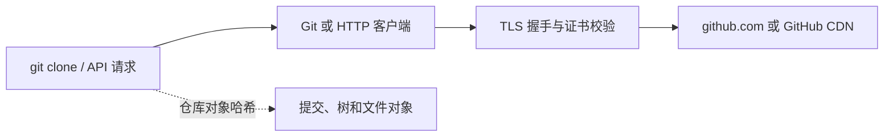

GitHub 在 2026 年 9 月 15 日发布公告，宣布按计划停用 github.com 和合作 CDN 在 HTTPS 中对 SHA-1 的使用，范围包括 GitHub Enterprise Cloud 及其 Data Residency 版本。GitHub Enterprise Server 不受这次变更影响。

这条消息容易引起一个误解：GitHub 停用的是 HTTPS/TLS 连接中的 SHA-1，不是把所有 Git 仓库里的 SHA-1 提交对象一夜之间改成另一种哈希。真正可能出问题的，是旧浏览器、旧 API 客户端、旧 Git、老操作系统组件，或者仍在使用过时 TLS 能力的企业代理。对开发者来说，现在更重要的工作是盘点连接链路，而不是批量重写仓库历史。

<!-- more -->

## 这次变更到底影响哪一层

SHA-1 曾经广泛用于数字签名、证书和其他安全协议。随着碰撞攻击研究不断推进，现代 HTTPS 配置已经逐步减少对它的依赖。GitHub 这次停用的对象，是访问 GitHub 网站、调用 GitHub API，以及通过 HTTPS 推送和拉取代码时所使用的 TLS 能力。

可以把一次常见的代码拉取拆成几层来看：



本次停用主要发生在中间的 TLS 连接层。客户端如果只支持旧的 SHA-1 相关算法，可能在建立 HTTPS 连接时失败；客户端即使能够使用 SHA-256 计算 Git 对象，也不代表它的 TLS 库足够新。反过来，一个支持现代 TLS 的客户端，仍然可以操作历史上使用 SHA-1 对象格式的仓库。

所以，看到“SHA-1 被停用”时，先不要执行下面这些没有针对性的操作：

- 不要因为 HTTPS 报错就删除 `.git` 目录或重新初始化仓库；
- 不要把 Git 提交哈希全部改写来解决 TLS 连接问题；
- 不要通过关闭证书校验、降低安全级别或跳过代理检查来“修复”问题。

后两种做法不仅可能无效，还会把连接问题变成更明显的供应链和中间人攻击风险。

## 最容易被遗漏的四类连接

GitHub 的旧公告明确提到，浏览器、使用 GitHub API 的软件，以及通过 HTTPS 通信的 Git 客户端都在影响范围内。实际排查时，不能只在自己的笔记本上打开一次 GitHub 页面就宣布完成。

### 1. 浏览器和开发者工具

现代浏览器一般已经具备新的 TLS 能力，但长期不升级的操作系统、嵌入式浏览器和远程桌面环境仍可能使用旧组件。GitHub 建议访问 `https://github.dev` 做兼容性测试，因为该站点已经禁用了 SHA-1。如果浏览器无法建立连接，应优先更新浏览器和操作系统，不要在浏览器里临时放宽安全设置。

### 2. Git 客户端与 HTTPS 后端

`git clone` 看起来只是一个命令，实际会依赖 Git 版本、TLS 后端和操作系统提供的加密库。Linux 上的 Git 可能使用 OpenSSL，其他平台则可能使用不同的系统 TLS 实现。版本过旧时，报错可能只表现为“无法访问远端”或“TLS 握手失败”，不一定直接提到 SHA-1。

可以先记录客户端和运行环境：

```bash
git --version
git config --show-origin --get http.sslBackend
curl -Iv https://github.com
```

其中，`git --version` 只能告诉你 Git 本身的版本，不能完全说明 TLS 后端版本。对 CI Runner、构建镜像和开发容器，也要在对应环境中执行检查，不能只检查宿主机。

### 3. API SDK 和自研集成

很多发布脚本、机器人、代码扫描器和内部平台并不直接调用 Git 命令，而是通过某个语言的 HTTP SDK 访问 GitHub API。SDK 版本、运行时和底层证书库中的任何一个过旧，都可能在新连接策略启用后暴露问题。

排查时应从实际发起请求的进程入手，记录运行时版本、HTTP 库、TLS 后端、代理地址和证书链。只升级业务依赖而忽略基础镜像，或者只升级基础镜像却没有重建锁定的运行时，往往会让问题继续留在生产环境里。

### 4. 企业代理和 TLS 检查设备

企业网络中的 HTTPS 连接可能经过代理或安全设备。此时，客户端看到的证书和 TLS 行为不一定直接来自 GitHub，代理自身也需要支持现代算法并正确转发连接。个人设备测试正常、CI 或办公网络测试失败，通常值得优先检查这条链路。

不要把代理证书加入信任库当成通用解决方案。信任企业 CA 与允许过时 TLS 算法是两个不同的问题，应该分别确认代理的协议配置、证书链和升级计划。

## GitHub Enterprise Server 为什么不在范围内

9 月 15 日的 GitHub 公告特别说明，GitHub Enterprise Server 不受影响。这并不表示自建实例可以永久保留旧的加密配置，而是说明这次 GitHub.com 及合作 CDN 的集中式变更没有直接修改企业自托管产品。

如果团队使用的是 Enterprise Server，仍然应该按自己的升级和安全基线检查 TLS 配置。更不能因为现网自建实例暂时可用，就假设访问 GitHub.com 的开发机、构建节点和外部 SaaS 集成也没有问题。两条连接路径可能使用不同的域名、证书、代理和加密库。

## 一份更稳妥的迁移清单

这类基础设施变更最适合按“客户端清单、分层验证、逐步切换”的方式处理：

1. **先盘点出口**：列出浏览器、开发机、CI Runner、构建镜像、API 服务、发布脚本和企业代理中所有访问 GitHub 的入口。
2. **再记录版本**：保存 Git、OpenSSL 或系统 TLS、语言运行时、HTTP SDK 和操作系统版本，避免只记录应用版本。
3. **做真实路径测试**：用实际的 CI 镜像和代理链路访问 `github.com`、GitHub API，并执行一次只读的 Git 拉取；不要只在本地执行 `curl`。
4. **优先升级组件**：升级 Git、运行时、HTTP 依赖、基础镜像和代理设备，随后重新构建并验证锁文件与发布产物。
5. **保留回滚证据**：记录升级前后的 TLS 日志、请求结果和错误样本，出现问题时可以判断是客户端、代理还是服务端路径。

如果服务必须在短期内兼容旧系统，应该把兼容范围和退出时间写进维护计划，而不是永久降低 TLS 安全级别。安全迁移最怕“先临时绕过，之后再处理”，因为绕过配置往往比正常升级更难被发现和清理。

## 结语

GitHub 停用 HTTPS 中的 SHA-1，是一次面向连接基础设施的兼容性收紧。它提醒开发者，代码托管平台的安全变更不仅影响网页访问，也会沿着 API、Git 客户端、CI 镜像和企业代理一路传导。

最值得先做的检查很简单：确认真实运行环境里的 Git、TLS 库和代理链路是否足够新，再把它和 Git 对象哈希问题分开处理。只要不把两个层次混在一起，升级路径通常比重写仓库历史更短，也更容易验证。

## 参考来源

- [GitHub Changelog：SHA-1 in HTTPS on GitHub sunset](https://github.blog/changelog/2026-09-15-sha-1-in-https-on-github-sunset)
- [GitHub Changelog：Sunsetting SHA-1 in HTTPS on GitHub](https://github.blog/changelog/2026-04-20-sunsetting-sha-1-in-https-on-github/)
