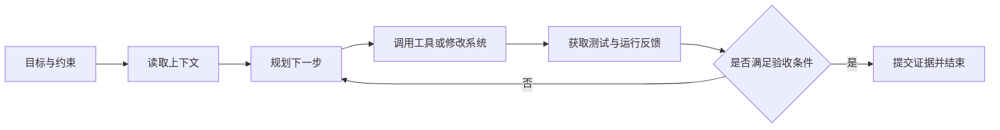

9 月 14 日，OpenAI 发布了一篇 Perplexity 的案例文章，称 Perplexity 正在使用 GPT-6 Astra 编写沟通内容、修改软件和监控生产系统，而且相比早期模型，工程师不需要频繁介入。这条消息的价值不在于又出现了一个模型名称，而在于它把 AI Agent 的工作范围从“生成一段答案”推进到了持续运行的工程系统。

这里需要保留一个事实边界：上述信息来自 OpenAI 的案例介绍，不是独立机构发布的横向基准测试，也没有公开足够细节让外部读者复现实验。它更适合被当作一个工程方向的信号来分析。一个 Agent 如果真的能在较少人工检查的情况下修改软件、观察生产状态，就必须同时解决状态保存、工具权限、结果验证、变更回滚和运行审计，而这些问题比模型能否写出代码更难。

<!-- more -->

## 从“会回答”到“能把事情做完”

传统的模型调用通常是一次请求对应一次响应：应用把上下文拼进 Prompt，模型返回文本，程序再决定是否采纳。代码助手虽然可以多轮对话，但开发者仍然是主要的调度者，负责选择文件、执行命令、查看错误并决定下一步。

端到端 Agent 的工作方式不同。它接收一个目标后，需要自己读取上下文，选择工具，执行动作，观察反馈，再决定是否继续。一个更贴近工程现实的循环大致是：

这个循环的重点不在于模型连续调用了多少次，而在于每一轮是否有可信的反馈。编写沟通内容时，反馈可能是格式检查和人工审批；修改软件时，反馈应包括测试、静态检查和代码差异；监控生产系统时，反馈则来自指标、日志、告警和变更记录。没有这些外部信号，所谓“端到端”很容易退化成一段较长的自动生成文本。

## “少检查几次”背后的三个技术条件

OpenAI 对 Perplexity 案例的概括是，使用 GPT-6 Astra 后，工程师可以比使用早期模型时更少检查 Agent 的进展。这个表述不等于“可以无人值守”，更合理的理解是：Agent 能够带着状态完成更多连续步骤，并在需要时提供可检查的结果。

### 1. 状态必须是持久的

长任务不能把所有信息都塞进当前上下文。至少要保存任务目标、已完成动作、工具输出、文件差异、失败原因、待办事项和验收证据。这样，Agent 下次恢复时读取的是结构化状态，而不是依赖一段越来越长、越来越难核对的对话记录。

这也要求任务有明确的阶段和退出条件。例如一次软件变更可以依次经过“理解问题”“修改代码”“运行测试”“生成差异摘要”几个状态。每个阶段都应该有可观察的产物，失败时能够停在某个检查点，而不是从头猜测之前发生了什么。

### 2. 工具调用要受到业务约束

Agent 的能力来自工具，但风险也从工具开始。读取仓库、修改工作区、执行测试、访问生产指标、发布版本，这些动作的风险等级并不相同，不能都放进一个没有区分的工具箱。

可以把权限拆成几层：

| 能力 | 适合的默认策略 | 需要的证据 |
| --- | --- | --- |
| 读取代码、文档和指标 | 默认开放给任务范围内的资源 | 访问日志、资源范围 |
| 在隔离工作区修改文件 | 允许 Agent 生成候选变更 | 差异、测试结果 |
| 合并代码或改变线上配置 | 需要独立审批或受限服务账号 | 审批记录、变更编号 |
| 删除数据、扩大权限或发布高风险版本 | 默认禁止，必须人工确认 | 风险说明、回滚方案 |

“少检查几次”只有在权限被提前收窄时才有意义。否则，减少人工介入只是把更多故障机会交给了一个很难预测的执行循环。

### 3. 验收标准不能由 Agent 自己定义

Agent 可以生成测试，也可以解释测试结果，但不能单独决定什么叫“已经完成”。确定性的检查应该尽量交给编译器、测试框架、静态分析器、部署系统和监控平台；Agent 负责理解失败信息、调整方案并提交下一次候选变更。

对于生产系统，最小的验证链路至少应包括：

1. 修改前记录当前版本和关键指标；
2. 在隔离环境或测试环境运行可重复的检查；
3. 通过小流量或有限范围的方式观察变更；
4. 发现异常时自动停止后续动作，并保留回滚入口；
5. 把每次工具调用、文件修改和决策结果写入审计日志。

这套链路的目标不是让 Agent 永远不犯错，而是让错误停留在可发现、可回退的范围内。

## 三类工作，不应使用同一种自动化强度

从 Perplexity 案例提到的三类工作看，编写沟通内容、修改软件和监控生产系统其实有不同的风险结构。

编写内容通常可以先生成草稿，再由人检查事实、语气和对外承诺。软件修改需要加入代码审查和自动化测试，尤其要防止 Agent 为了让测试通过而改变测试本身。生产监控则应优先从只读开始，把告警解释和排障建议交给 Agent，把重启服务、修改配置或扩大资源等动作放进明确的审批流程。

因此，团队可以用“观察、建议、执行”三个级别逐步放权：

- **观察**：Agent 读取数据，生成摘要和异常线索，不修改系统。
- **建议**：Agent 在隔离环境中提出补丁、配置或操作计划，由人确认后执行。
- **执行**：只对低风险、可回滚、边界明确的动作开放自动执行，并设置时限和资源上限。

同一个 Agent 也不必在所有任务中拥有相同权限。权限应该跟着任务类型和当前阶段变化，而不是跟着模型名称永久绑定。

## 落地时先测什么

如果团队准备把类似能力接入内部研发或运维流程，第一步不应是追求最长的无人值守时间，而是建立一组能反映实际风险的指标：

- 任务完成率，以及首次完成后仍需要人工返工的比例；
- Agent 修改范围是否超出任务声明的文件和资源；
- 测试失败、回滚和人工接管的次数；
- 从发现问题到提交可验证产物所需的时间；
- 每个任务消耗的模型调用、计算资源和人工检查时间；
- 出现异常后，系统从停止到恢复所需的时间。

这些指标能帮助团队分辨两件容易混在一起的事：Agent 是否真的减少了重复劳动，以及它是否只是把检查和收尾工作推迟到了流程末端。只有在低风险任务上获得稳定结果，才有理由扩大工具范围或延长连续运行时间。

## 结语

Perplexity 使用 GPT-6 Astra 的案例，展示了 Agent 从“协助完成一步”走向“持续推进一项工作”的可能性。它同时提醒工程团队，模型能力只是这条链路的一部分。持久状态让任务能够恢复，外部验证让结果可以被相信，最小权限和回滚机制则决定错误会停在哪里。

真正值得借鉴的不是“让 Agent 少被人打断”这一句话，而是为每一个自动动作准备边界、证据和退出路径。只读观察、隔离变更、确定性验证和逐步放权，可能比单纯追求更强的模型更快把端到端 Agent 变成可靠的工程工具。

## 参考来源

- [OpenAI：Perplexity trusts GPT-6 Astra with end-to-end systems](https://openai.com/index/perplexity-improving-accuracy-with-astra)
- [OpenAI：GPT-6 Astra—A new generation of intelligence](https://openai.com/index/gpt-6-astra)
