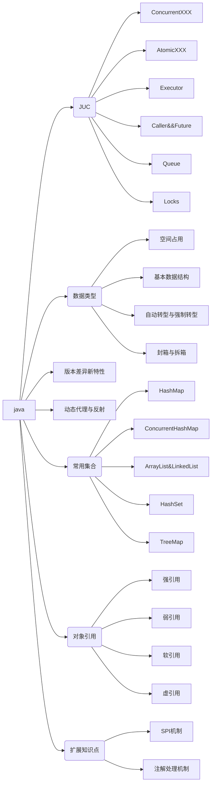

```mermaid
graph LR
java --> B(JUC)
B --> ConcurrentXXX
B --> AtomicXXX
B --> Executor
B --> Caller&&Future
B --> Queue
B --> Locks

java --> C(数据类型)
C --> 空间占用
C --> 基本数据结构
C --> 自动转型与强制转型
C --> 封箱与拆箱

java --> 版本差异新特性
java --> 动态代理与反射

java --> E(常用集合)
E --> HashMap
E --> ConcurrentHashMap
E --> ArrayList&LinkedList
E --> HashSet
E --> TreeMap

java --> F(对象引用)
F --> 强引用
F --> 弱引用
F --> 软引用
F --> 虚引用

java --> G(扩展知识点)
G --> SPI机制
G --> 注解处理机制
```

