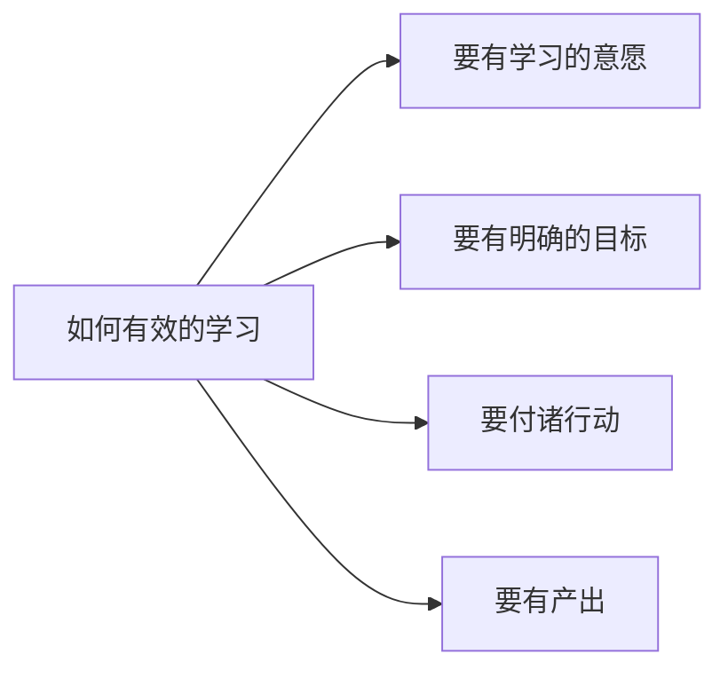

## 如何有效的学习
<!-- more -->

### 1.要有学习的意愿。

“授人以鱼不如授人以渔，授人以渔不如授人以欲”，欲望是基础。

### 2.要明确学习的目标。

得知道自己也要学什么，明确的提出一个目标，而不是笼统的“好好学习”。

### 3.付诸实践。

“千里之行，始于足下”，没有行动，想法再好也没有用。在实践阶段，拆解目标是非常重要的，要把大目标拆成一个个小目标来完成。

### 4.学习要有产出。

人其实有生产者和消费者两种角色。如果没有产出的话，只学习本身是一种消费。你每天忙着读书、看专栏，看起来付出了很多，超级努力超级辛苦，但如果没有产出，工作和生活也没有什么改变，那这样的学习和玩一会儿手机、看一会儿电影在本质上并没有太大的区别，只是一种另类的娱乐。

