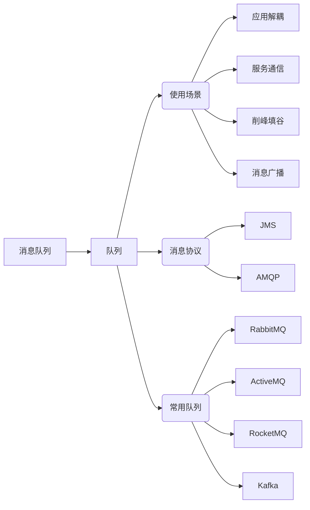

### 消息队列

```mermaid
graph LR
消息队列 --> B[队列] --> B1(使用场景)
B1 --> 应用解耦
B1 --> 服务通信
B1 --> 削峰填谷
B1 --> 消息广播
B --> B2(消息协议)
B2 --> JMS
B2 --> AMQP
B --> B3(常用队列)
B3 --> RabbitMQ
B3 --> ActiveMQ
B3 --> RocketMQ
B3 --> Kafka


```
<!-- more -->
