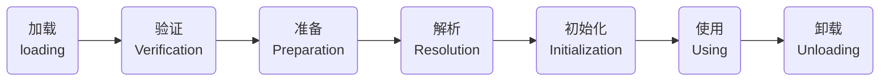

类加载

类的生命周期

1. 虚拟机规范严格规定了有且只有5中情况必须立即对类进行初始化（而加载、验证、准备自然要在此之前）：
2. 遇到new、getstatic、putstatic、或invokestatic这4条指令是，如果类没有进行过初始化，则先触发初始化。
3. 使用java.lang.reflect包的方法对类进行反射调用的时候，如果类没有进行过初始化，则要先触发初始化。
4. 当初始化一个类的时候，如果发现其父类还没有初始化，则要先触发其父类初始化。
5. 当虚拟机启动时，用户需要指定一个要执行的主类（包含main()方法的那个类），虚拟机会初始化这个主类。
6. 当使用JDK1.7的动态语言支持时，如果一个java.lang.invoke.MethodHandle实例最后的解析结果REF_getStatic、REF_putStatic、REF_invokeStatic的方法句柄，并且这个方法句柄所对应的类没有进行初始化，则要先触发初始化。

